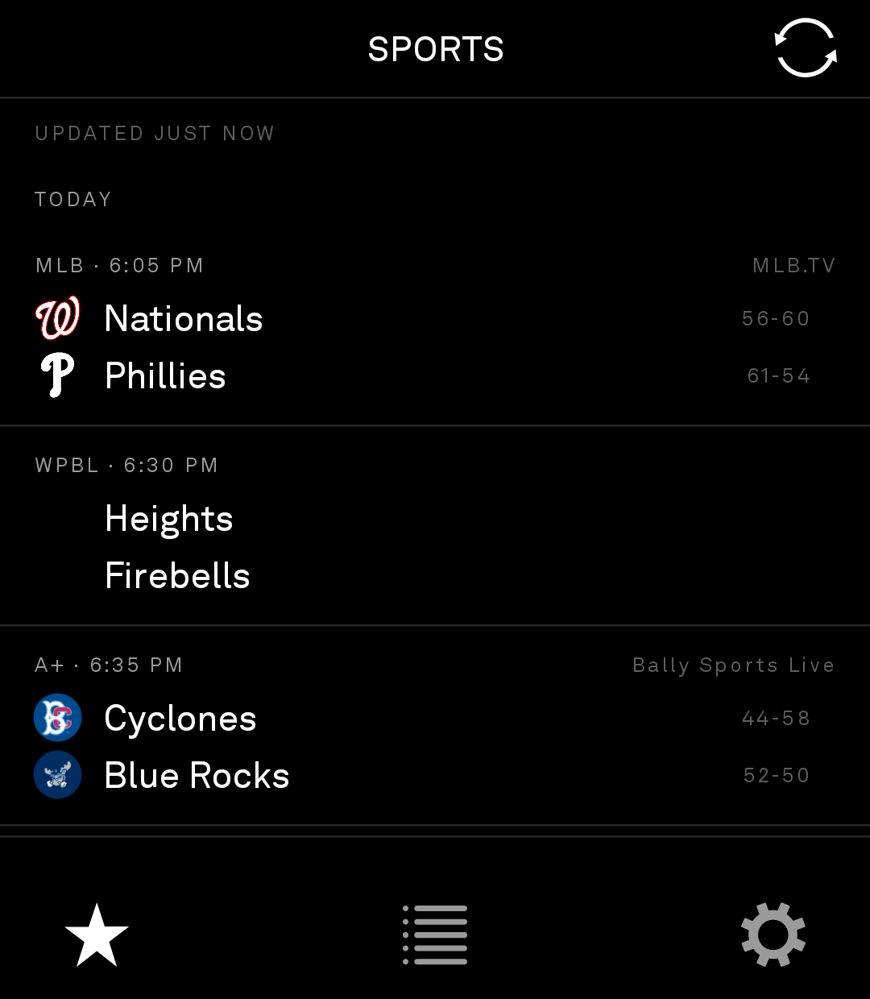
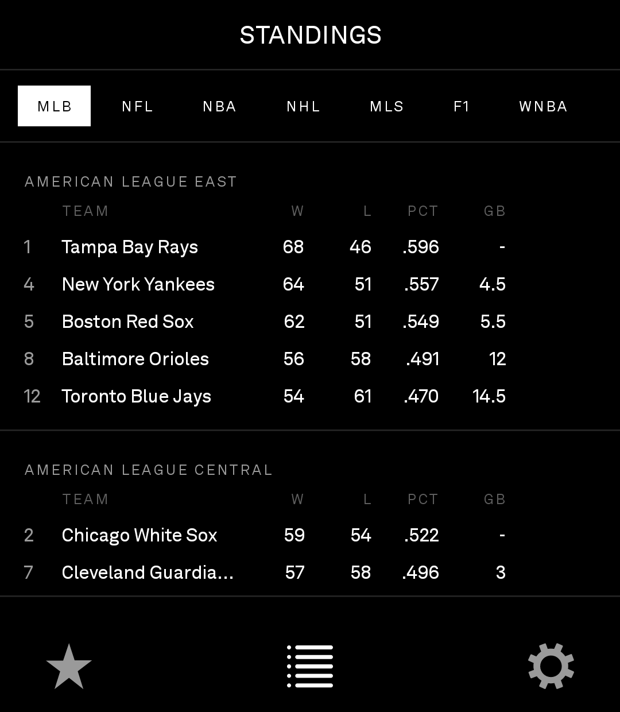
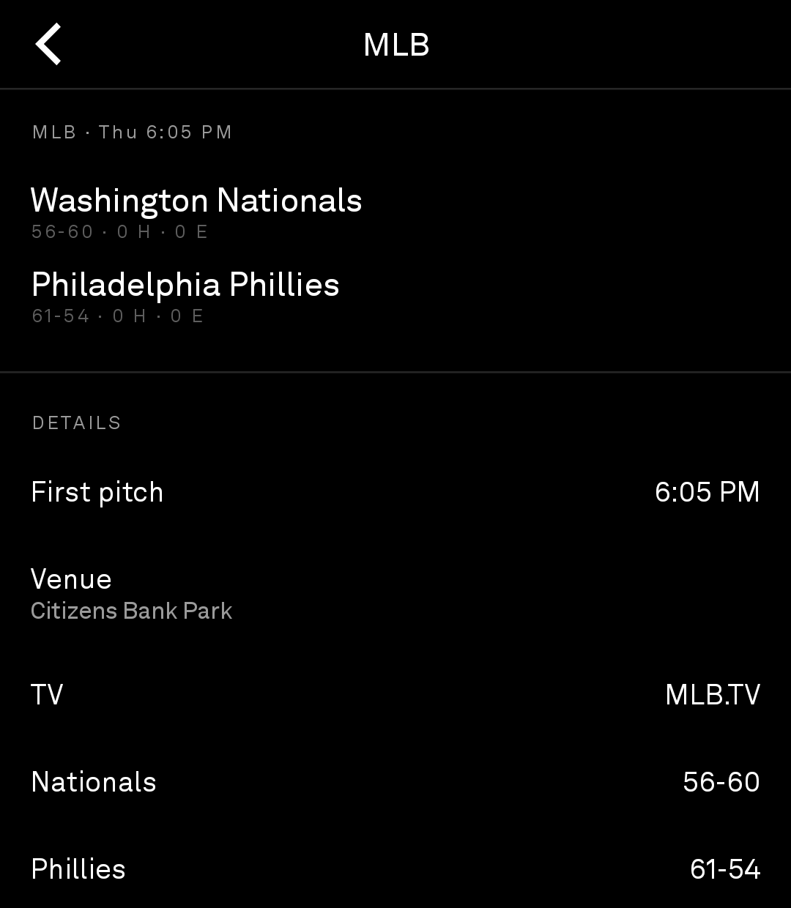

# BrightSports

A scores app for the **Light Phone III**. Follow your teams, see one column of scores,
get notified when something happens. Launcher label: **Sports**, package
`com.gios.lightsports`. Current released version: **v1.10.18**.

## Install via BrightMarket

<p align="center">
  
</p>

Scan the code above with **BrightMarket** installed to open BrightSports there and
install or update it directly. Don't have BrightMarket yet? Get it, and browse
every Bright app, at
**[gi-os.github.io/brightmarket-index/browse.html](https://gi-os.github.io/brightmarket-index/browse.html)**.

<table>
  <tr>
    <td align="center">
      <br>
      <sub>Scores: one column, grouped by day</sub>
    </td>
    <td align="center">
      <br>
      <sub>Standings: by division, one tab per league</sub>
    </td>
    <td align="center">
      <br>
      <sub>Game: start time, venue, TV and records</sub>
    </td>
  </tr>
</table>

Taken on a Light Phone III.

## Why this exists

LightOS has no built-in scores surface and no Google Play Services, so this is a plain
sideloaded APK (not a Light SDK tool) built from the same skeleton as the rest of the
`gi-os` portfolio, minus Room/KSP/CameraX — follows are a `SharedPreferences` string set
and caches are plain files, so there's no annotation processor in the build at all.

## Quick start

1. `git clone https://github.com/gi-os/BrightSports.git && cd BrightSports`
2. Build or grab the release:
   ```
   ./gradlew :app:assembleRelease
   ```
   or `adb install -r` the newest APK from [Releases](../../releases/latest) — every push
   to `main` cuts one.
3. Open the app, go to **Settings → My teams**, and follow a league + club (or an entire
   category — see below). The scores feed populates from there; no account or API key
   needed anywhere.

## Leagues and data sources

| | |
|---|---|
| Majors | MLB, NFL, NBA, NHL, MLS (+ Leagues Cup, U.S. Open Cup) |
| Soccer | EPL, LaLiga, Bundesliga, Serie A, Ligue 1, UEFA Champions League, UEFA Europa League |
| College football | FBS (~140 teams, filtered from ESPN's ~750-team college football feed) |
| Women's | WNBA, NWSL, PWHL, WPBL |
| Minor league baseball | Triple-A, Double-A, High-A, Single-A |
| Racing | Formula 1 |

Twenty-two leagues, four **keyless** public JSON providers — no account, no key to paste in:

- **ESPN site API** — the majors, the European soccer leagues, college football, the
  women's leagues (except PWHL), F1.
  `site.api.espn.com/apis/site/v2/sports/<sport>/<league>/scoreboard`. One parser covers
  every team sport; the response shape is identical. Standings live at
  `site.api.espn.com/apis/v2/sports/.../standings?level=3` and nest differently per
  league — walk the `children` tree rather than indexing it.
- **MLB StatsAPI** — the four MiLB levels by `sportId` (11/12/13/14 = AAA/AA/A+/A). ESPN
  publishes no minor-league scoreboard; this is the feed MiLB.com itself runs on.
- **HockeyTech / LeagueStat** — the PWHL, which is on no mainstream scores API.
  `client_code=pwhl`, feed key `694cfeed58c932ee`, the public one thepwhl.com ships in its
  own front end.
- **WPBL stats service** — the Women's Pro Baseball League, which is on no mainstream
  scores API either, despite ESPN carrying every game of the broadcast.
  `stats.womensprobaseballleague.com/v1/games` and `/v1/teams`, the same endpoints the
  league's own public game centre calls from the browser.

### Seven endpoint traps, all silent — worth knowing before touching the parsers

1. **ESPN's `teams` endpoint silently ignores its own `groups` filter.**
   `teams?groups=80` for college football answers 200 with a full team list — just not
   a filtered one. It's the alphabetically-first slice of all ~750 teams across FBS
   through Division III, cut off at whatever `limit` was sent, so "Abilene Christian"
   through the A's and B's shows up looking exactly like a correctly-filtered FBS
   roster. The `scoreboard` and `standings` endpoints both honor the filter (as
   `groups=` and `group=` respectively — no relation between the two spellings), and
   the standings tree carries a full team object at every leaf, so for any league with
   [`League.espnGroup`] set the roster is sourced from there instead of `teams`.
2. **MLB StatsAPI's `standings` endpoint ignores `sportId` entirely** and answers with an
   empty record set. Expand the level via `/leagues?sportId=11` and ask by
   `leagueId=117,112,…` instead; `hydrate=team` then carries the division *name*, which
   the records themselves don't.
3. **HockeyTech's `statviewfeed` standings come back wrapped in a bare pair of
   parentheses** — JSONP residue — strip before parsing JSON. `modulekit&view=statviewtype`
   looks like the standings view but isn't; it errors.
4. **The WPBL feed answers with the whole season and no date parameter**, so the
   fetch window has to be applied after parsing. Leave it off and every September
   fixture counts as an upcoming game in August, which arms the pre-game nudge against
   the wrong one. That feed also has no standings endpoint at all — `/v1/teams` carries
   `wins`/`losses`/`streak` and leaves them zeroed, and the league's own site computes
   its table in the browser from finished games, so `WpblParser.standings` does the same
   over the same `counts_in_standings` flag. Line score, hits and errors are a separate
   ~35 KB request per game and are deliberately not fetched: the notification poll runs
   every two minutes and shares this code path.
5. **ESPN leaves `completed:false` on F1 sessions of race weekends that finished months
   ago** — Bahrain and Saudi Arabia 2026 both do. Keying race state off that flag pinned
   both Grands Prix to LIVE at the top of the feed for the rest of the season. Fix: read
   the per-session `status.type.state` string plus the event `endDate`, never the
   `completed` flag. Those same two events also publish no finishing order, so a podium
   can legitimately come back empty.
6. **A delay or suspension rides on top of the ordinary state, on both providers, rather
   than replacing it** — confirmed live on both sides. ESPN reports a rain delay as
   `state: "in"`, `completed: false`, `name: "STATUS_RAIN_DELAY"`: identical to a normal
   live game unless the name is checked. MLB StatsAPI is worse: a postponed game reports
   `abstractGameState: "Final"` (reads as a completed game, and refires a FINAL alert
   with the body "Postponed" every time a pending reschedule flips the feed between
   `Preview` and `Final`), and a suspended one reports `"Live"` (reads as an ordinary
   game in progress, so the pause carries no alert and neither does it clearing). Both
   parsers now check the delay/suspend/postpone/cancel wording first and map all of it
   to `GameState.OFF`, which is also what makes a resume alert possible at all —
   `ScoreDiff.Kind.RESUMED` fires exactly once on the transition back to `LIVE`. The
   WPBL's own status string had the identical bug by design: `"in progress" ||
   "delay" -> LIVE`, so an active weather delay ("In Progress - Weather Delay") read
   as an ordinary live game too, for the same underlying reason — checked in the wrong
   order against a status string that names two states in one sentence.
7. **A postponed MiLB game with a make-up date is listed twice in one schedule
   response, under the same `gamePk`, with conflicting statuses** — confirmed live for
   the Brooklyn Cyclones, gamePk 821809: `detailedState: "Postponed"` under its
   original date, `"Scheduled"` again under the reschedule date. Both survive the
   app's multi-day fetch window, and since the notification poll keeps one snapshot per
   game *id*, the second duplicate processed silently overwrote whichever snapshot the
   first one had just recorded — so the "already told you about this" marker never
   actually stuck, and the next poll found the same stale unseen snapshot and refired
   the postponed alert every two minutes, forever. `StatsApiParser.parseSchedule` now
   dedupes by id, keeping whichever duplicate's state is more specific (`OFF` or
   `FINAL` over a bare `PRE`) — one `Game` per id from there on, so there is nothing
   left downstream to overwrite.

Also: ESPN omits seconds from timestamps (`2026-07-29T16:10Z`), which stock
`ISO_INSTANT` rejects — one lenient `DateTimeFormatterBuilder` covers all three
providers. `LocalDate.ofInstant` is Java 9 and missing from Android's java.time subset;
use `Instant.atZone().toLocalDate()` instead.

MLS clubs also play knockout competitions ESPN serves as separate leagues — the Leagues
Cup and the U.S. Open Cup — which reuse the parent league's team ids (NYCFC is `17606` in
all three), so a followed club is matched with no extra configuration. The roster check
is deliberately skipped inside a cup (the field is full of Liga MX and USL clubs); both
cups are fetched every poll, adding ~260ms to a ~430ms total. NWSL has no cup on ESPN
(four slug spellings all 400).

## Screens

Navigation follows the LightOS bar idiom: a top bar with the title and back chevron, a
four-icon action bar along the bottom. `ui/LightBars.kt` rebuilds `LightTopBar` and
`LightBottomBar` from Light's own `sdk/ui` — same 27-column grid, same 3-/4-unit bar
heights, same LightOS icon drawables — reimplemented rather than imported, because the
SDK artifacts sit on GitHub Packages behind a token and this ships as a plain APK.

- **Scores** — one feed, followed teams only, grouped Live / Today / Tomorrow / Upcoming
  / Recent, each club's crest on its line, finished games dim the loser (colour isn't
  available). Followed teams with nothing in the window show "no game scheduled" rather
  than being dropped, so "between fixtures" isn't confused with "failed to load."
- **My teams** — league then club, searchable. F1 is followed as a series. Each league
  also has two category stars: **Championship games** and **Special games** — star one
  and you get those fixtures whoever's playing, resolved by one predicate
  (`Game.involves`) shared by the feed filter, the notification poll and the standings
  highlight. **Hold a followed team to silence it**: still in the feed and the standings,
  just no alerts. The notifier matches against follows *minus* silenced, which is why a
  derby still alerts — Yankees–Mets with the Mets silenced matches on the Yankees.
  Silencing one team never silences a game the other is in.
- **Standings** — followed leagues only, your team's row inverts. **Hold a row** for
  every stat the provider sent — three or four times what fits the table: run
  differential, streaks, home/away splits, a driver's points at every round.
- **Settings** — my teams, notifications, spoiler delay.

Crest loading (`ui/Logos.kt`, ~70 lines, no image library) downsamples on decode — ESPN
serves 500px crests, a megabyte of ARGB_8888 for a 24dp view — so the cache is
byte-bounded, not count-bounded. Sources: ESPN `team.logos[]` filtered to the entry whose
`rel` contains `dark` (the default is white outlines that vanish on black);
`midfield.mlbstatic.com/v1/team/<id>/spots/64` for MiLB (`mlbstatic.com/team-logos/<id>.svg`
is SVG and `BitmapFactory` can't decode it); `team_logo_url` from HockeyTech's
`teamsbyseason`. Verified working for 297 teams across the 12 team leagues.

The special-events classifier (`data/SpecialEvents.kt`) came out of a 12-month sweep of
8,231 ESPN games:

- The round lives in a different field per sport — US leagues in
  `notes[0].headline` ("Super Bowl LX") with a flat `season.slug`; soccer the reverse
  (MLS Cup is `slug=mls-cup` with no note, so a notes-only rule missed MLS Cup and the
  NWSL Championship entirely).
- `season.type` is not usable — MLS All-Star reports `13846`.
- Some fixtures carry no title in either field — the MLS and MLB all-star games are only
  identifiable by a competitor absent from the league's own team list.
- Match slug rounds on the last `---` segment exactly — `semifinals` and `quarterfinals`
  both *contain* "final".
- Drop preseason outright, or NBA-vs-Guangzhou and WNBA-vs-Niger friendlies trip the
  off-roster rule and top the feed.
- `limit=200` on the scoreboard silently truncates (a fortnight of MLB is >200 games
  league-wide); it's 1000 now.

## Notifications

Alerts are [BrightChat](https://github.com/gi-os/BrightChat)'s notifier design, carried over
wholesale: the shade notification is the *record* (drives LightGlance's dot too), and a
box over whatever's on screen is the *alert* — an overlay window (`ScoreAlertOverlay`)
when awake and unlocked, so nothing underneath is paused; a full activity
(`ScoreAlertActivity`, `showWhenLocked` + `turnScreenOn`) when the screen is off or
locked, because an overlay sits below the keyguard and can't wake the panel.

```
adb shell appops set com.gios.lightsports SYSTEM_ALERT_WINDOW allow
```

Without that, the buzz still fires and the notification still posts — only the box is
missing. Vibration is disabled on both channels so the box owns the buzz, rate-limited to
one per 1.5s.

Per-sport loudness: `EVERY_SCORE` for baseball/hockey/soccer/football, **`PERIOD_ONLY` for
basketball** (forty buckets a night is a pager, not a notification), `FINAL_ONLY` for F1.
A game seen for the first time never alerts, so installing mid-Sunday doesn't replay the
day. Score alerts are held 5 minutes by default against stream spoilers; several scores in
one window collapse into a single notification.

Every sport except baseball also gets a **period mark** (halftime, end of quarter,
intermission) — a 0-0 halftime still counts, since the mark doesn't wait for a score.
Which period just ended is read from three signals, since none covers everything: ESPN
names the phase for soccer (`STATUS_HALFTIME`), falls back to a flat
`STATUS_IN_PROGRESS` for the US leagues (the human text says "End of 1st Quarter"
instead), and failing both, the period number going up means the previous one ended —
which reads one poll late. Deduplicated against the last period marked (halftime is 15
minutes, the poll runs every 2). Baseball is `EVERY_SCORE` + no marks — nine innings and
eighteen half-innings would make marks noise, and MLB's own text already says "End 2nd"
so the detector fires and the flag is what suppresses it.

A pre-game nudge fires 15 minutes before a followed team's kickoff — the only alert that
fires with nothing changed, so it's guarded by a flag persisted on the snapshot rather
than a state transition (the lead window spans 7-8 polls).

Runs on `AlarmManager.setAndAllowWhileIdle` — the only alarm that survives Doze, and its
firing is what grants the short network window the poll needs. No repeating form exists,
so each firing arms the next; both boot and app launch re-arm the chain, since a
force-stop cancels every alarm an app owns. Expect roughly a 9-minute floor between checks
once the screen's been off a while; `adb shell dumpsys deviceidle whitelist
+com.gios.lightsports` removes the throttle.

## The wheel

Turning the brightness wheel scrolls whatever list is up — the feed, a game, the table,
the team picker, settings — with **nothing installed but BrightSports itself**: no
service, no permission, no root. LightOS relabels the wheel sensor's scancodes 19/20 as
`WHEEL_CCW`/`WHEEL_CW` in `/system/usr/keylayout/Generic.kl`, and nothing intercepts them,
so they reach the focused window like any other key event — which is also why an app
that ignores the keycode looks like it has a dead wheel. `hw/LightKeys.kt` resolves the
labels at runtime and falls back to the raw scancode, gated on the sensor's device name
so a paired keyboard's `r` can't scroll the standings.

Handling lives in `dispatchKeyEvent`, above the view hierarchy, so a notch beats the team
search field when it has focus. Notches are frame-timed rather than applied on arrival
(the sensor fires every ~35ms, faster than a frame), and the first notch after a pause is
held until a second confirms it, since the wheel sits under a thumb.

Only turns are handled — the wheel click and the camera button do nothing here. Optional,
separate install for those: [BrightControl](https://github.com/gi-os/BrightControl) gives
the whole phone brightness (hold wheel + turn), flashlight (tap), and camera (camera
button), each rebindable. It passes bare turns straight through to `com.gios.*`
deliberately, so it doesn't cost this app its own scrolling.

```bash
adb install -r LightControl-v1.0.x.apk

# NOTE: this replaces the accessibility-service list — colon-join if you also run
# LightVoice's push-to-talk.
adb shell settings put secure enabled_accessibility_services \
  com.gios.lightcontrol/com.gios.lightcontrol.keys.ControlService
adb shell settings put secure accessibility_enabled 1

adb shell appops set com.gios.lightcontrol WRITE_SETTINGS allow
adb shell appops set com.gios.lightcontrol SYSTEM_ALERT_WINDOW allow
```

## Building

```
./gradlew :app:testDebugUnitTest      # parsers, feed bucketing, notification gating — 42 tests
./gradlew :app:assembleRelease
python3 scripts/generate_icon.py      # only if the launcher mark changes
```

Every push to `main` cuts a GitHub Release — **a push is a release trigger, not a
cosmetic action**. The APK is signed with the committed keystore
(`keystore/lightsports.jks`), and CI fails if the certificate drifts from
`signing-fingerprint.txt` (an Obtainium update otherwise dies with a bare
`Failure: Invalid`).

**Only the pure-Kotlin sources are type-checked locally** — Compose files reach a
compiler for the first time in CI, so a missing import survives a green local run. A grep
for named model types against each UI file's imports catches it in seconds before pushing.

### The versionName trap

Release tags are `v<major.minor>.<CI run number>`, with the base parsed from
`app/build.gradle.kts`. **Bumping that only in a throwaway clone means the next push
reads the old value and can publish a *lower* version string than the release before
it** — which is exactly what happened once here: `v1.0.5` landed chronologically after
`v1.1.4` (see the table below), and a lower version string is precisely what makes
Obtainium skip an update. Bump `versionName` in the tracked source, not a scratch copy.

## Contributing

Issues and PRs welcome.

- Run `./gradlew :app:testDebugUnitTest` before sending a change — it's pure Kotlin and
  fast, and it's the only local signal for the parsers, feed bucketing and alert gating.
- If you touch any Compose file, do a full `./gradlew :app:assembleDebug` locally rather
  than trusting a "green" unit-test run — Compose isn't type-checked outside a real build.
- New league or provider quirks belong in the endpoint-traps list above and, if they
  affect classification, in `data/SpecialEvents.kt` with a `SpecialEventsTest` case.
- CI publishes a release on every push to `main` — verify locally before pushing there.

## Version history

| Version | Change |
| --- | --- |
| v1.12.24 | Add the big-five European soccer leagues, both UEFA cups, and FBS college football |
| v1.13.25 | Stop repeating a delay notification, and say when the game is back |
| v1.14.26 | Fix the WPBL's own version of the same delay bug |
| v1.15.27 | Fix the actual cause: a postponed MiLB game listed twice with conflicting statuses |
| v1.10.18 | Track the WPBL, on the league's own stats feed |
| v1.9.17 | Silence a followed team without unfollowing it |
| v1.8.16 | Rewrite the README for v1.8.15 (docs) |
| v1.8.15 | Note that wheel scrolling needs nothing else installed (docs) |
| v1.8.14 | Mark the end of each period, in every sport but baseball |
| v1.7.13 | Alert with BrightChat's notifier, and nudge before kickoff |
| v1.6.12 | Scroll with the wheel |
| v1.6.11 | Fold the Leagues Cup and U.S. Open Cup into the MLS feed |
| v1.5.10 | Follow special games and championship games as categories |
| v1.4.9 | Import StandingsRow in StandingsScreen (build fix) |
| — | Crests in the feed, full stats on a held standings row, and stop losing teams |
| v1.3.7 | Star for the scores tab |
| v1.2.6 | Bump versionName to 1.2.0 and say what it's for |
| v1.0.5 | Move team editing under settings; three icons in the action bar *(see the versionName trap above — this tag is out of chronological order, landing after v1.1.4)* |
| v1.1.4 | Use the LightOS bar idiom for navigation, and stop pinning finished races to live |
| v1.0.3 | README: describe the app on its own terms |
| — | BrightSports: scores and standings on the Light Phone III (initial commit) |

## Licence

MIT.
